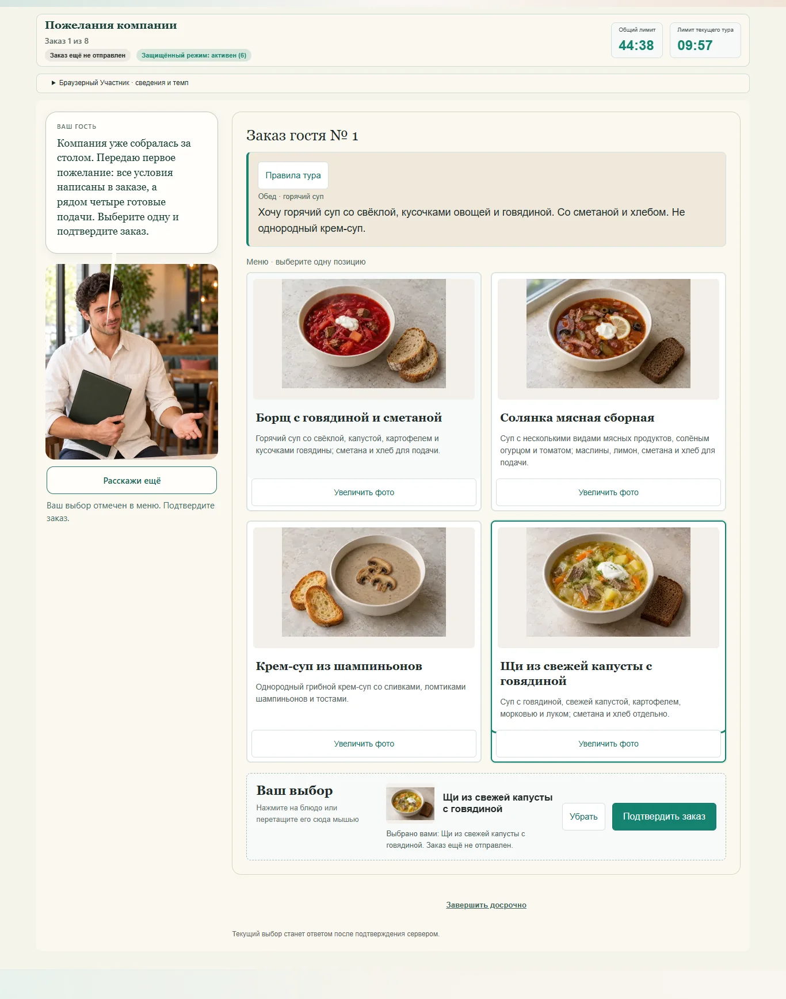
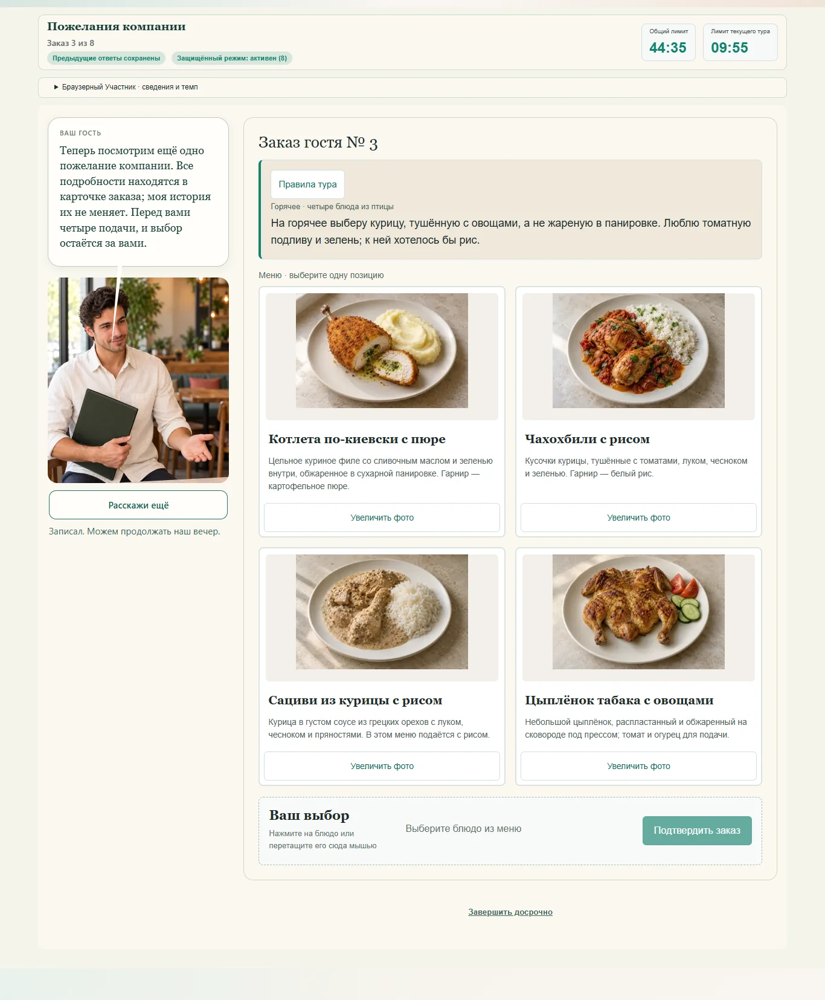

# Приёмка обновлённого меню Т4

09.10.2026. Редакция меню / условий 3. Все участники технических проверок создавались в изолированных локальных базах; основной сайт проверяется без регистрации технических участников.

## Локальная проверка

- `npm.cmd test`: 289 проверок проходят. Новые проверки охватывают однозначность всех восьми заказов, отсутствие рецептурных ключей в вопросе участника, отдельные рейтинги редакций 1/2/3, неизменность старого меню и его результатов, новые изображения итогового стола. Прежняя проверка 210 составов Т5 сохранена.
- `npm.cmd run build:cloudflare`: успешно. `verify:pm01` на отдельном полном сервере `http://127.0.0.1:3224`: успешно; ПМ.01 не изменялся.
- Репетиция SQLite через D1-совместимый адаптер: 50 участников / 1800 ответов и 60 / 2160. В обоих проходах нет серверных ошибок, потерянных или продублированных ответов. Точные p95 находятся в [локальном отчёте](assets/olympiad-t4-menu-v3/local-load.json).
- Реальный Chromium, изолированная SQLite: весь маршрут 36 заданий, 150 баллов, публикация 51 подачи, свидетельство сразу после личного завершения. Для Т4 — все восемь заказов и 32 увеличения без выбора, очистка и замена черновика, перезагрузка и возврат фокуса. Каждая карточка содержит полное описание и загруженное фото; новые заработанные подачи загружаются отдельно. [Браузерный отчёт](assets/olympiad-t4-menu-v3/browser.json).
- Проверены девять размеров каждой главы: 1536×1024, 1440×900, 1366×768, 1024×900, 768×900 и ширины 320/360/390/430. Все восемь заказов дополнительно просмотрены отдельно на 1366 и 390; все 32 исходные фотографии и шесть прозрачных подач просмотрены по отдельности. Нет горизонтального переполнения или обрезанных описаний. Фото/правила Т4 не блокируют восстановление защищённого режима. Сенсорный ввод, уменьшенная анимация, отсутствие декора, ошибки фото и сети проверяются общим маршрутом.
- Получено 4 264 382 байта уменьшенных изображений вместо 26 367 710 байт эквивалентных оригиналов (84% сокращения). Это размер переданных файлов, не замер скорости сети колледжа. Для снимков меню переходные анимации завершены средствами браузера; исходное оформление не изменяется.

Специализированный браузерный тестовый коннектор недоступен в данной среде: использован действующий репозиторный Playwright-сценарий с настоящим Chromium, дополненный проверками нового меню. Скриншоты получены с работающих экранов, а не из статических макетов.

## Снимки работающего интерфейса

Мобильные снимки: [супы](assets/olympiad-t4-menu-v3/order-1-390.webp), [птица](assets/olympiad-t4-menu-v3/order-3-390.webp). Новые изображения заработанных блюд: [винегрет](assets/olympiad-t4-menu-v3/earned-2.webp), [чахохбили](assets/olympiad-t4-menu-v3/earned-3.webp), [жаркое](assets/olympiad-t4-menu-v3/earned-4.webp), [судак](assets/olympiad-t4-menu-v3/earned-5.webp), [равиоли](assets/olympiad-t4-menu-v3/earned-6.webp), [медовик](assets/olympiad-t4-menu-v3/earned-8.webp).

## Ограничение приёмки

Рецептурные источники и основания выбора приведены в [проверке меню](olympiad-t4-menu-v3.md). Понятность и фактическая сложность нового меню на студентах ещё не измерены. Просмотр преподавателем и репетиция на устройствах колледжа остаются отдельной педагогической приёмкой; технический выпуск её не заменяет.

Результаты Cloudflare preview и production записываются в отдельный выпускной отчёт после фактического развёртывания.
