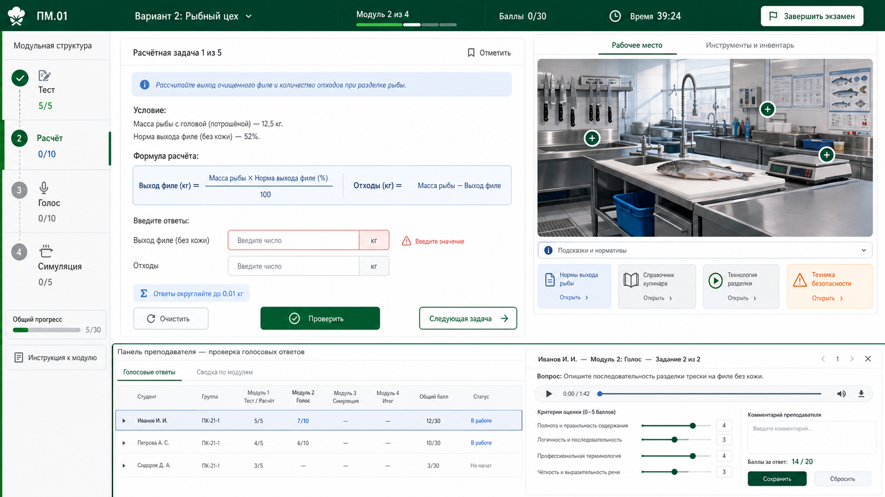

# Интерактивный экзамен ПМ.01 на базе платформы олимпиады

Источник: `C:\Users\АМИД\Desktop\Интерактивный_экзамен_ПМ01_МДК0101_0102_концепция.pdf`.

## Реализовано в рабочей версии

- Студенческий экран: `/pm01.html`.
- Кабинет преподавателя: `/pm01-admin.html`.
- Данные и задания: `data/exams/pm01.js`.
- Автопроверка, итоговая оценка и ручная проверка голоса: `src/pm01-engine.js`.
- API PM01: `/api/pm01/public/exam`, `/api/pm01/public/attempts/start`, `/api/pm01/public/attempts/:id/answer`, `/api/pm01/public/attempts/:id/finish`.
- API преподавателя: `/api/admin/pm01/summary`, `/api/admin/pm01/attempts`, `/api/admin/pm01/attempts/:id`, `/api/admin/pm01/attempts/:id/voice/:questionId/review`, `/api/admin/pm01/exports/csv`, `/api/admin/pm01/exports/json`.
- Визуальные assets: `public/assets/pm01/*.png`.
- Проверки: `tests/pm01-engine.test.js`, общий `npm.cmd test`.

## Цель

Сделать на базе текущей платформы отдельный цифровой экзамен по ПМ.01 / МДК 01.01-01.02 для профессии `43.01.09 Повар, кондитер`.

Важно: рабочую олимпиаду на `https://olympiada.gorlkts.ru/` не ломаем. Новый экзамен лучше вести как отдельный режим/экран и отдельную конфигурацию, чтобы олимпиада по национальным кухням продолжала работать.

## Главная идея реализации

PDF не нужно переносить в программу как набор таблиц. Его нужно превратить в интерактивную производственную мастерскую.

Студент не выбирает “билет”, а входит в один из пяти цехов:

- овощной участок;
- рыбный участок;
- мясной участок;
- участок птицы, дичи и кролика;
- комплексная зона заказа, упаковки и реализации.

Каждый вариант должен начинаться с экрана производственной ситуации. Этот экран задает контекст: кто студент в цехе, какое сырье поступило, что нужно подготовить и какие компетенции проверяются. После этого студент проходит четыре рабочих станции:

- `Тест`: быстрые решения и термины;
- `Расчет`: сырье, отходы, нетто/брутто, партия, стоимость;
- `Голос`: профессиональное объяснение вслух;
- `Симуляция`: рабочее место, инструменты, нарушения, маркировка и технологическая цепочка.

По ощущениям это должен быть не сайт с вопросами, а экзаменационный cockpit: слева маршрут модулей, сверху статус, время и баллы, в центре текущее задание, справа профессиональная сцена цеха или справочные материалы. Пример визуального направления сохранен здесь:



Такой подход дает современность без лишней игры: студент работает в цифровой мастерской, а преподаватель видит не только итоговый балл, но и качество профессионального мышления.

## Что в PDF

Экзамен рассчитан на 5 фиксированных вариантов:

- вариант 1: овощной цех, овощи, грибы, формы нарезки, заявка, сборник рецептур;
- вариант 2: рыбный цех, обработка рыбы, полуфабрикаты, рыбная котлетная масса;
- вариант 3: мясной цех, мясо, субпродукты, рубленая масса, оборудование;
- вариант 4: птица, дичь, кролик, обработка тушек, полуфабрикаты, хранение;
- вариант 5: комплексный заказ, заявка, расчет, обработка, упаковка, подготовка к реализации.

Структура каждого варианта:

- модуль 0: производственная ситуация;
- модуль 1: интерактивный тест, 20 баллов;
- модуль 2: расчетно-технологические задачи, 30 баллов;
- модуль 3: голосовой профессиональный ответ, 20 баллов, проверяет преподаватель;
- модуль 4: интерактивная производственная симуляция, 30 баллов.

Итоговая шкала:

- `90-100`: 5;
- `75-89`: 4;
- `60-74`: 3;
- `<60`: 2.

## Что уже есть в нашей платформе

Уже готово и можно переиспользовать:

- регистрация студента;
- старт попытки;
- таймер и пошаговое прохождение;
- один вопрос на экране;
- сохранение попыток в `storage/` локально и в YDB на production;
- API для участника и админки;
- админ-панель с попытками, баллами и экспортом;
- типы заданий `single_choice`, `sequence_drag`, `bucket_sort`, `ingredient_matrix`;
- редактор банка заданий;
- Yandex Cloud deploy через GitHub Actions;
- desktop-режим Electron.

## Чего не хватает

Нужно добавить:

- множественный выбор в тестах;
- расчетные задачи с полями ввода, единицами измерения, допуском `0.01`;
- справочные блоки формул;
- режим тренировки с объяснением после ответа;
- голосовой ответ через браузерный `MediaRecorder`;
- хранение аудиофайлов или audio data в хранилище;
- ручную проверку голоса по 4 критериям по 5 баллов;
- кликабельные изображения с зонами нарушений;
- отдельную оценку `2/3/4/5`, а не дипломы олимпиады;
- Excel/PDF-ведомость по студентам, вариантам и модулям.

## Лучший способ встроить в проект

Не переделывать текущую олимпиаду в экзамен напрямую. Лучше сделать платформу многоформатной:

- текущая олимпиада остается как `national-kitchens-2026`;
- новый экзамен получает свой id, например `pm01-2026-exam`;
- данные экзамена лежат отдельно: `data/exams/pm01.js`;
- экран участника можно открыть отдельно: `/pm01.html`;
- админку можно расширить фильтром по мероприятию или сделать `/pm01-admin.html`.

Так мы сможем поддерживать оба продукта на одном сервере и домене.

## Новые типы заданий

### `multiple_choice`

Для тестов, где правильных ответов несколько.

```js
{
  type: "multiple_choice",
  prompt: "...",
  maxScore: 2,
  options: [
    { id: "a", text: "...", isCorrect: true },
    { id: "b", text: "...", isCorrect: false }
  ]
}
```

Проверка: полный балл за точный набор, частичный балл можно считать по совпадениям с штрафом за лишнее.

### `calculation_task`

Для расчетов брутто, нетто, отходов, партии, стоимости.

```js
{
  type: "calculation_task",
  prompt: "...",
  formulas: [
    "М отходов = М брутто × W / 100",
    "М нетто = М брутто − М отходов"
  ],
  fields: [
    { id: "wasteKg", label: "Масса отходов", unit: "кг", expected: 3.36, tolerance: 0.01 },
    { id: "netKg", label: "Масса нетто", unit: "кг", expected: 8.64, tolerance: 0.01 }
  ],
  solutionSteps: [
    "М отходов = 12 × 28 / 100 = 3,36 кг",
    "М нетто = 12 − 3,36 = 8,64 кг"
  ],
  maxScore: 10
}
```

### `voice_response`

Для профессионального устного ответа.

```js
{
  type: "voice_response",
  prompt: "...",
  answerPlan: ["качество сырья", "рабочее место", "операции", "хранение"],
  rubric: [
    { id: "topic", label: "Ответ по теме", maxScore: 5 },
    { id: "tools", label: "Инструменты и оборудование", maxScore: 5 },
    { id: "sequence", label: "Последовательность работы", maxScore: 5 },
    { id: "safety", label: "Санитария, безопасность и хранение", maxScore: 5 }
  ],
  maxScore: 20,
  manualReview: true
}
```

Студент записывает аудио 1-2 минуты, отправляет, видит статус `Ответ отправлен преподавателю`. Преподаватель слушает и выставляет баллы.

### `hotspot_scene`

Для поиска нарушений на картинке.

```js
{
  type: "hotspot_scene",
  prompt: "Найдите нарушения на рабочем месте.",
  image: "/assets/pm01/fish-workshop-violations.jpg",
  hotspots: [
    { id: "no_cooling", label: "Рыба без охлаждения", x: 42, y: 61, radius: 7 },
    { id: "dirty_knives", label: "Грязные ножи", x: 18, y: 33, radius: 6 }
  ],
  maxScore: 6
}
```

Координаты лучше хранить в процентах от изображения, чтобы сцена была адаптивной.

## Визуальная концепция

Новый экзамен должен ощущаться как профессиональная учебная мастерская:

- светлый фон;
- крупный читаемый вопрос;
- верхняя панель: `ПМ.01`, вариант, модуль, баллы, время;
- боковая шкала модулей: тест, расчет, голос, симуляция;
- зеленый: правильно;
- красный: ошибка;
- синий: справка и формулы;
- оранжевый: безопасность;
- профессиональные изображения цехов, инструментов, сырья и полуфабрикатов;
- без чрезмерной игровой стилистики.

Для симуляций нужны 5 комплектов изображений:

- овощной участок с нарушениями;
- рыбный участок с нарушениями;
- мясной участок и мясорубка;
- рабочее место птицы/кролика;
- зона упаковки и хранения комплексного заказа.

Изображения можно сгенерировать через `imagegen` или подготовить по реальным фото колледжа. Если используем реальные фото, интерфейс будет методически сильнее, потому что студент увидит знакомую среду.

## Панель преподавателя

Нужно расширить текущую админку:

- таблица студентов;
- вариант;
- баллы по модулям: тест, расчет, голос, симуляция;
- итоговый балл из 100;
- оценка `2-5`;
- статус голосового ответа: `не записан`, `ожидает проверки`, `проверен`;
- карточка проверки аудио;
- аудиоплеер;
- 4 критерия по 0-5;
- комментарий преподавателя;
- кнопка `Сохранить оценку`.

## Плагины и инструменты

Новые внешние плагины для браузера не нужны.

Нужно использовать:

- `Build Web Apps` — проектирование и реализация современного интерфейса;
- `imagegen` — концепты экранов и, при необходимости, изображения цехов/нарушений;
- `GitHub` — фиксация изменений, ветка, PR, деплой;
- браузерная проверка/Browser automation — после внедрения для проверки экранов и адаптива.

Технически:

- аудио пишется через стандартный `MediaRecorder API`;
- drag-and-drop уже есть;
- кликабельные зоны делаются обычным HTML/CSS/JS поверх изображения;
- расчеты проверяются на сервере через новый scorer;
- YDB нужно расширить для аудио/ручных оценок или хранить аудио отдельными файлами/Blob-хранилищем.

## Этапы реализации

### Этап 1. Основа экзамена

- добавить `data/exams/pm01.js`;
- перенести 5 вариантов из PDF в структурированный банк;
- добавить типы `multiple_choice` и `calculation_task`;
- добавить scoring под 100 баллов;
- сделать экран `/pm01.html`;
- пройти модуль 1 и 2 полностью.

### Этап 2. Голосовой ответ

- добавить `voice_response`;
- добавить запись аудио в интерфейсе студента;
- добавить серверный прием аудио;
- добавить ручную проверку в админке;
- пересчет итогового балла после проверки преподавателем.

### Этап 3. Производственные симуляции

- подготовить 5 сцен;
- добавить тип `hotspot_scene`;
- добавить проверку зон и подсветку ошибок;
- добавить смешанные симуляционные задания: hotspot, sequence, bucket sort.

### Этап 4. Тренировочный режим и методика

- добавить переключатель `экзамен / тренировка`;
- в тренировке показывать решение после ответа;
- в экзамене скрывать подсказки;
- добавить матрицу компетенций в админку.

### Этап 5. Экспорт и production

- ведомость Excel/PDF;
- экспорт аудио/комментариев;
- deploy на production;
- проверка на домене `https://olympiada.gorlkts.ru/`.

## Первое MVP

Самый разумный первый результат:

- отдельный `/pm01.html`;
- выбор одного из 5 вариантов;
- модуль 0, 1 и 2 работают полностью;
- тесты и расчеты проверяются автоматически;
- админка видит баллы по первым двум модулям.

После этого можно спокойно добавлять аудио и симуляции, не рискуя всей платформой.
